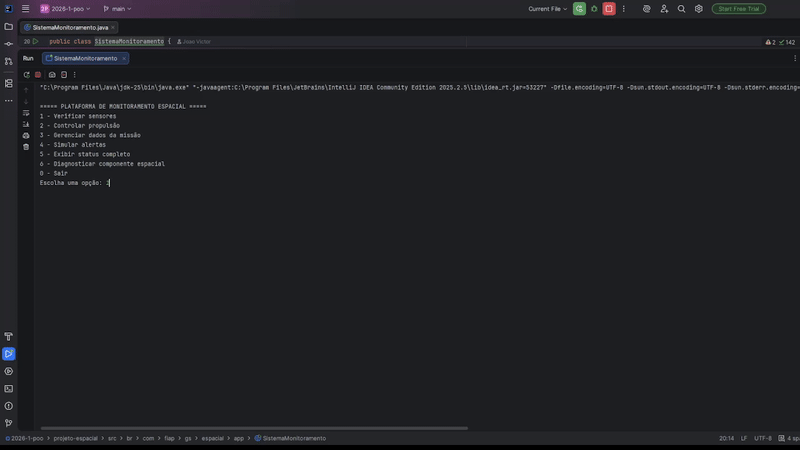

# Plataforma de Monitoramento de Sistemas Espaciais

## Global Solution 2026 — Programação Orientada a Objetos (POO)

Sistema desenvolvido em Java com foco na aplicação prática dos principais conceitos de Programação Orientada a Objetos, incluindo abstração, encapsulamento, herança, polimorfismo e interfaces.

O projeto simula uma plataforma de monitoramento utilizada em uma estação espacial, responsável por supervisionar sensores críticos, sistemas de propulsão e dados operacionais da missão, permitindo a identificação automática de falhas e emissão de alertas em tempo real.

---




---

# Integrantes

**Nome**: João Victor Alves de Abreu | **RM**: 564946

**Nome**: Luiz Henrique Barbosa Dias | **RM**: 562399

---

# Objetivo do Projeto

O principal objetivo deste sistema é demonstrar, de forma prática e organizada, a utilização dos conceitos fundamentais de POO por meio de um cenário tecnológico inspirado em sistemas espaciais modernos.

A aplicação foi estruturada para representar um ambiente de monitoramento inteligente capaz de:

* Simular leitura de sensores espaciais;
* Monitorar parâmetros críticos da missão;
* Controlar sistemas de propulsão;
* Validar informações operacionais;
* Emitir alertas automáticos;
* Proteger dados sensíveis da missão;
* Fornecer interação via menu textual no console.

---

# Tecnologias Utilizadas

* Java 17+
* IntelliJ IDEA
* Programação Orientada a Objetos (POO)
* Estrutura modular com pacotes
* Clean Code
* Console Application

---

# Conceitos de POO Aplicados

## 1. Abstração

Utilização de classes abstratas para definição de comportamentos genéricos compartilhados entre componentes espaciais.

### Classe:

* `ComponenteEspacial`

### Responsabilidades:

* Definir atributos comuns;
* Padronizar comportamentos;
* Garantir implementação obrigatória de métodos abstratos.

---

## 2. Interface

Padronização dos sensores por meio da interface `Sensor`.

### Interface:

* `Sensor`

### Métodos obrigatórios:

* `lerValor()`
* `verificarFuncionamento()`
* `getTipoSensor()`

### Implementações:

* `SensorTemperatura`
* `SensorPressao`
* `SensorRadiacao`

---

## 3. Encapsulamento

Proteção de dados críticos da missão através de atributos privados e métodos controlados.

### Classe:

* `DadosMissao`

### Funcionalidades:

* Proteção por senha;
* Validação de combustível;
* Controle de coordenadas;
* Restrição de acesso a dados sensíveis.

---

## 4. Herança

Reaproveitamento de código através da especialização de sistemas de propulsão.

### Classe abstrata:

* `SistemaPropulsao`

### Implementações:

* `PropulsaoQuimica`
* `PropulsaoEletrica`

Cada tipo de propulsão possui comportamento próprio para cálculo de empuxo e aceleração.

---

# Funcionalidades do Sistema

## Sistema de Sensores

O sistema realiza a simulação de sensores espaciais responsáveis pelo monitoramento ambiental da estação.

### Recursos:

* Leitura automática de valores;
* Simulação com números aleatórios;
* Verificação de funcionamento;
* Definição de limites críticos;
* Geração automática de alertas.

---

## Sistema de Propulsão

Permite controlar diferentes tipos de motores espaciais.

### Recursos:

* Ligar/desligar motores;
* Controle de potência (0–100%);
* Validação de parâmetros;
* Cálculo de empuxo;
* Diferentes comportamentos por tipo de propulsão.

---

## Sistema de Alertas

Responsável pela identificação de situações críticas.

### Níveis de alerta:

* ATENÇÃO
* ALERTA
* CRÍTICO

### Eventos monitorados:

* Temperatura elevada;
* Radiação excessiva;
* Pressão anormal;
* Baixo nível de combustível.

---

## Gerenciamento de Missão

Controle centralizado dos dados operacionais da missão espacial.

### Recursos:

* Coordenadas protegidas;
* Controle de tripulação;
* Trajetória da missão;
* Monitoramento de combustível;
* Validação de entradas.

---

# Estrutura do Projeto

```text
projeto-espacial/
│
├── src/
│   └── br/com/fiap/gs/espacial/
│
├── app/
│   └── SistemaMonitoramento.java
│
├── componentes/
│   ├── ComponenteEspacial.java
│   └── EstacaoEspacial.java
│
├── sensores/
│   ├── Sensor.java
│   ├── SensorTemperatura.java
│   ├── SensorPressao.java
│   └── SensorRadiacao.java
│
├── propulsao/
│   ├── SistemaPropulsao.java
│   ├── PropulsaoQuimica.java
│   └── PropulsaoEletrica.java
│
├── missao/
│   └── DadosMissao.java
│
├── alertas/
│   ├── NivelAlerta.java
│   └── SistemaAlerta.java
│
└── util/
    └── ConsoleUtils.java
```

---

# Como Executar o Projeto

## Pré-requisitos

* Java JDK 17 ou superior
* IntelliJ IDEA (recomendado)

---

## Passos para execução

### 1. Clone o repositório

```bash
git clone https://github.com/seu-usuario/projeto-espacial.git
```

---

### 2. Abra o projeto no IntelliJ

* Clique em `Open`;
* Selecione a pasta do projeto.

---

### 3. Execute a aplicação

Classe principal:

```text
SistemaMonitoramento.java
```

---

# Credenciais de Acesso

Para visualizar coordenadas protegidas:

```text
Código de acesso: ORBITA-2026
```

---

# Exemplo de Execução

```text
=========== SISTEMA ESPACIAL ===========
1 - Verificar sensores
2 - Controlar propulsão
3 - Gerenciar missão
4 - Simular alertas
5 - Exibir status completo
0 - Encerrar sistema
========================================
```

---

# Boas Práticas Aplicadas

* Separação de responsabilidades;
* Organização modular em pacotes;
* Métodos coesos;
* Nomes descritivos;
* Baixo acoplamento;
* Reutilização de código;
* Validação de entradas;
* Tratamento de erros;
* Estrutura escalável.

---

# Possíveis Melhorias Futuras

* Interface gráfica com JavaFX;
* Persistência em banco de dados;
* Integração com APIs espaciais reais;
* Dashboard em tempo real;
* Sistema distribuído de monitoramento;
* Logs avançados;
* Testes automatizados com JUnit.

---

# Considerações Acadêmicas

Este projeto foi desenvolvido com finalidade educacional para a disciplina de Programação Orientada a Objetos, visando consolidar conceitos fundamentais da orientação a objetos por meio de uma aplicação contextualizada em sistemas espaciais.

A proposta busca simular cenários próximos de aplicações reais da indústria aeroespacial, promovendo o desenvolvimento de habilidades relacionadas à modelagem de software, organização arquitetural e desenvolvimento orientado a boas práticas.

---

# Autor

João Victor Abreu
FIAP — Ciência da Computação
Global Solution 2026 — POO
